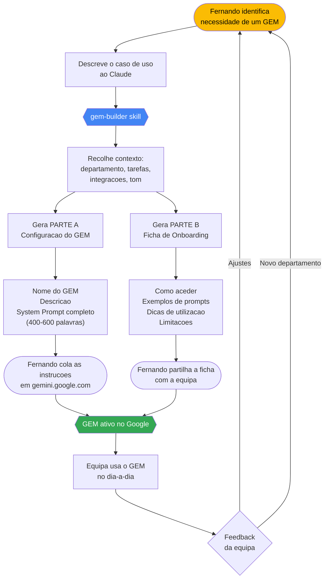
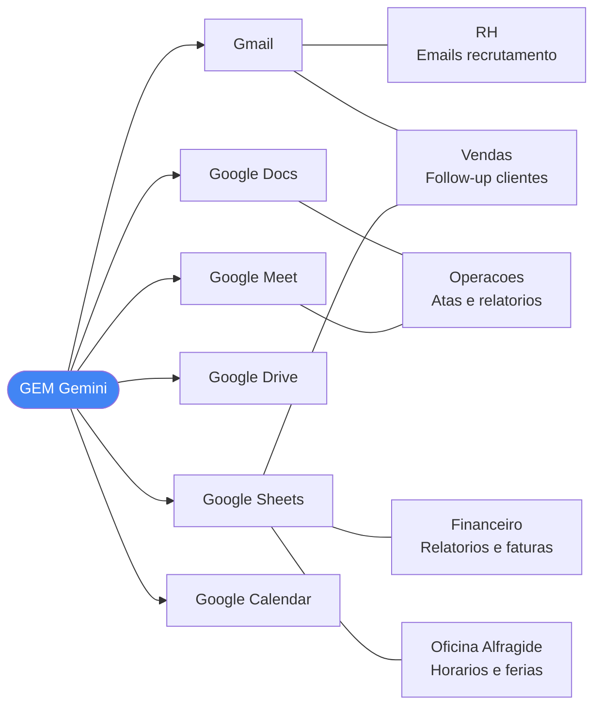
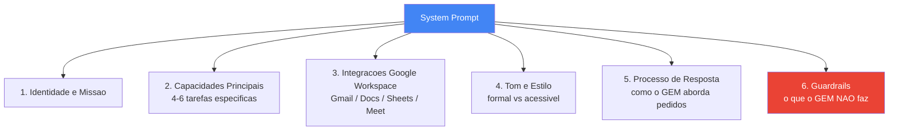

# Projeto GEM — Google AI Agents para Google Workspace

## Contexto

Projeto de Fernando Nankov para posicionar-se como Líder de IA na empresa.
A empresa opera 100% em **Google Workspace** (Gmail, Docs, Sheets, Drive, Meet, Calendar).

O objetivo é criar **Google GEMs** — agentes Gemini personalizados — para múltiplos departamentos, democratizando o uso de IA internamente.

**Repositório GitHub:** https://github.com/Nankov-ai/Agente-gestao-horarios
- Branch principal: `main`
- Directório local: `c:\projetos\GEM`
- Inclui: prompt activo, Apps Script, documentação, versões arquivadas (Python, Gemini)

---

## O que é um Google GEM

Um GEM é um agente de IA personalizado construído sobre o Gemini. Configura-se com:
- **Nome**: curto e memorável
- **Descrição**: 1-2 frases do que faz
- **Instructions**: o system prompt que define o comportamento, persona e capacidades

Para criar um GEM: `gemini.google.com` → "Gems" → "Create a gem"

---

## Workflow do Projeto



---

## Departamentos em Curso

| Departamento | Estado | GEM | Foco Principal |
|---|---|---|---|
| RH / Recrutamento | Planeado | Assistente RH | Triagem CVs, emails, descrições de funções |
| Vendas / Comercial | Planeado | GEM Vendas B2B | Propostas, follow-up, análise pipeline Sheets |
| Financeiro | Planeado | Analista Financeiro | Faturas, relatórios, Sheets |
| Operações | Planeado | GEM Operações | Atas, relatórios de projeto, Docs/Meet |
| Marketing | Futuro | — | — |
| Jurídico | Futuro | — | — |
| IT / Suporte | Futuro | — | — |

---

## GEM Especializado — Oficina Alfragide (Em Desenvolvimento Ativo)

GEM de gestão de horários para a Oficina do Centro de Alfragide. Mais complexo que os GEMs departamentais standard — inclui conformidade com Direito do Trabalho português, gestão de folgas rotativas, férias e continuidade entre meses.

**Ficheiro do prompt (versão ativa):** `c:\projetos\GEM\agente-horarios-alfragide-claude.md` — linguagem natural, estrutura em 8 PARTS, com pré-locks no esqueleto

**Versões de referência (pasta python-gem):**
- `python-gem\agente-horarios-alfragide.md` — v2 Python (algoritmo estruturado, não usar — GEMs não executam Python)
- `python-gem\agente-horarios-alfragide-v3-csp.md` — v3 Python CSP (mantido para referência)
- `agente-horarios-alfragide.md` — versão NL anterior (base da versão ativa)

**Nota técnica — limitação do Gemini com .xlsx:** O Gemini só lê a primeira folha de um ficheiro .xlsx. Para ler todas as folhas, usa-se o Apps Script de exportação que gera um CSV combinado com todas as secções.

**Fonte de dados — fluxo atual (CSV combinado via Apps Script):**
1. Abrir o Google Sheets da Oficina de Alfragide
2. Menu **📅 GEM Alfragide → Exportar para GEM** (Apps Script instalado)
3. Descarregar o ficheiro `alfragide-gem.csv` do link mostrado no diálogo
4. Anexar `alfragide-gem.csv` no chat do GEM antes de pedir o horário

**Apps Script de exportação:** `c:\projetos\GEM\gem-export-script.gs`
- Instalar: Google Sheets → Extensões → Apps Script → colar o conteúdo → Guardar
- Menu gerado: `📅 GEM Alfragide` com dois itens: "Exportar para GEM" e "Diagnóstico"
- "Diagnóstico" lista todas as folhas do ficheiro com nome, linhas e colunas — útil para verificar instalação
- A exportação gera secções `=== Nome da Folha ===` para cada folha, incluindo automaticamente a folha do mês anterior (deteta pelo nome do mês em português)
- Não usar URL nem Knowledge sources — o CSV combinado via Apps Script é o único método fiável

**Formato do CSV combinado (6 secções):**
```
=== Equipa e regras ===
[dados]

=== Códigos ===
[dados]

=== Horários ===
[dados]

=== Férias ===
[dados]

=== Ausências ===
[dados]

=== [Mês anterior, ex: Maio 2026] ===
[dados]
```

**Estrutura do ficheiro de dados (5 folhas obrigatórias + histórico):**
- `Equipa e regras` — lista de colaboradores, turnos permitidos, regras individuais
- `Códigos` — legenda de todos os códigos de turno + horários início/fim (necessário para validação 11h)
- `Horários` — grelha template de horário
- `Férias` — dias FED por colaborador (valor "1" = dia de férias)
- `Ausências` — AJD, COD, BMD e outras ausências
- *(+ folha do mês anterior para carryover — detetada automaticamente pelo Apps Script)*

**Modelo obrigatório:** Gemini Pro (Flash e Thinking param a meio das instruções e não leem as férias)

**Dias de encerramento:** apenas 25 de dezembro, 1 de janeiro e Domingo de Páscoa. Todos os outros feriados são dias normais de operação (oficina aberta 7 dias/semana, 365 dias/ano).

**Regra da fonte única:** um dia só é folga/férias se estiver marcado nos ficheiros. Feriados nacionais não geram folgas automáticas.

**Avaliação de qualidade:** o output é revisto por Claude (Anthropic) e ChatGPT (OpenAI) — declarado no prompt para aumentar a precisão do modelo.

**Códigos de horário (versão ativa):**
- `FOD` = Folga Dia Completo (rotativa ou garantida)
- `COD` = Folga Compensatória
- `AJD` = Ausência Justificada
- `BMD` = Baixa Médica
- `FED` = Férias
- `FECHO` = Dia de encerramento (só 3 dias/ano)

**Regras implementadas no prompt (estrutura em 8 PARTS):**

| Secção | Conteúdo |
|---|---|
| MANDATORY SETUP | Instrução de uso do Apps Script + formato CSV combinado; BLOQUEIO se ficheiro não tiver secções `=== ... ===` |
| PART 0 | Golden Rules: idioma pt-PT, fonte única (CSV combinado), Source-Only Rule, Excel Sovereignty Rule, avaliação LLM |
| PART 2 | Hierarquia de 4 níveis: Lei > Dados Fixos > Cobertura > Preferências |
| PART 3 — STEP 3.1 | Leitura das 5 secções obrigatórias por header `=== ... ===` + horários dos turnos (Códigos) |
| PART 3 — STEP 3.4 | Listagem de todas as secções do CSV (STEP 3.4.0); carryover do mês anterior (contador C, último turno, fim de semana garantido, folgas em transição) |
| PART 3 — STEP 3.5 | Leitura da secção "Férias" (aceita variantes com/sem acento); coluna mapping pós-leitura (não-bloqueante); secção em branco = válida |
| PART 3 — STEP 3.6 | Leitura da secção "Ausências" (aceita variantes); secção em branco = válida |
| PART 3 — STEP 3.7A | Esqueleto: Lock 1 FED, Lock 2 AJD/COD/BMD, Lock 3 F-LOCK (buffer férias), Lock 4 F-LOCK-HOLE (dia isolado entre FED), Lock 5 FOD-FIXED (folgas contratuais), Lock 6 Suplência F-LOCK |
| PART 3 — STEP 3.7B | Stagger plan (máx. 2 col./fim de semana) + verificação de completude (todos os colaboradores com direito a fim de semana garantido devem ter um atribuído); Lock 7 WORK-ONLY (Sáb/Dom não-garantidos bloqueados para FOD); Lock 8 NO-FOD (Sex/Seg adjacentes ao fim de semana garantido); Lock 9 Mutual Backup FOD Exclusion (pares de suplência mútua nunca folgas em simultâneo); colocação rotativa de FODs com distribuição equitativa por dia da semana |
| PART 3 — STEP 3.7C/D | VERIFY A (≤5 dias consecutivos); VERIFY B (cobertura geral + ⭐ fins de semana + especialidades + verificação de completude do stagger) |
| PART 4.1 | Lei n.º 7/2009 — máx. 5 dias consecutivos, 2 folgas/semana, 11h descanso interjornadas |
| PART 4.2 | ⭐ Coverage Floor (Sáb/Dom — BLOQUEIO se incumprido), Specialty Coverage (ML/PN), Senior Tech presence, Vacation Buffer Rule, FED-HOLE Rule, FED-WEEK Rule, Suplência Rule, FOD pairs proibidos (Sex+Sáb, Dom+Seg, Qui+Sex, 3+ consecutivos); FOD-FIXED vs. FOD rotativo clarificado |
| PART 4.4/4.5 | Contador C com carryover; Weekly Rest Day Counter com exceções FED-WEEK e Lock 7/8 |
| PART 5 — STEP 4 | Processo interativo em 4 passos com aprovação obrigatória + F-LOCK Integrity Rule; guia de seleção de código de turno (abertura vs. fecho; seniores primeiro; nunca defaultar para um único código) |
| PART 6 | Auditoria pré-voo Steps A–H: consecutivos, completude, pares FOD (inclui ABSOLUTE BAN Sex+Sáb+Dom/Sáb+Dom+Seg), buffer FED, especialidades/sénior, 11h descanso; relatório de carryover fim de mês |
| PART 7 | Output TSV **no chat apenas** (proibido criar Google Docs/Drive); códigos reais de Códigos obrigatórios (proibidos placeholders); fórmula de cobertura em 3 passos com identidade aritmética; piso ⭐ para Sáb/Dom |
| PART 8 | Error handling: BLOQUEIO por cobertura, suplência, folha em falta, impossibilidade matemática |

---

## Ecossistema Google Workspace nos GEMs



---

## Anatomia de um System Prompt GEM



---

## Skills Instaladas

### gem-builder
```
C:\Users\Utilizador\.claude\skills\gem-builder\SKILL.md
```
**Como usar**: Descreve o departamento e caso de uso ao Claude → a skill gera o GEM completo.

**Output garantido**:
- PARTE A: Nome + Descrição + System Prompt pronto a colar no Google
- PARTE B: Ficha de onboarding para a equipa (como aceder, exemplos de prompts, dicas)

**Evals testados** (iteration 1): RH/Recrutamento, Vendas B2B, Operações

---

## Regras de Qualidade dos GEMs

- **Língua**: Sempre português europeu. `ficheiro` não `arquivo`, `equipa` não `time`, `telemóvel` não `celular`
- **Extensão do system prompt**: 300-600 palavras para GEMs departamentais; GEMs especializados (como Alfragide) podem ser mais extensos
- **Especificidade**: Cada GEM deve parecer feito à medida para aquele departamento
- **Testabilidade**: O utilizador deve ver valor nos primeiros 60 segundos de uso
- **Guardrails**: Sempre presentes — definem o que o GEM não faz, constroem confiança
- **Fonte de dados (GEMs departamentais)**: Preferir Google Sheets (URL) em vez de upload de .xlsx — o Gemini lê Sheets nativamente folha a folha
- **Fonte de dados (Alfragide)**: CSV combinado gerado pelo Apps Script (`gem-export-script.gs`) — o único método fiável. Upload de .xlsx só lê a primeira folha. URL e Knowledge sources leem folhas erradas ou número errado de colaboradores.

---

## Próximos Passos

### Alfragide (prioridade imediata)
1. Testar com horário real de julho anexando `alfragide-gem.csv` gerado pelo Apps Script
2. Validar que as violações identificadas foram eliminadas:
   - Pares FOD consecutivos (Seg+Ter, etc.)
   - 3 FODs na mesma semana (fim de semana garantido + FOD rotativo)
   - Cobertura ❌ em Sextas-feiras e Terças-feiras
   - BLOQUEIO ignorado (publicação com dias ❌)
3. Iterar com feedback da equipa da oficina até aprovação

### GEMs Departamentais
5. Criar GEM para RH com a skill gem-builder
6. Criar GEM para Vendas com a skill gem-builder
7. Criar GEM para Financeiro
8. Criar GEM para Operações
9. Expandir para departamentos adicionais (Marketing, Jurídico, IT)

---

## Alterações ao Prompt Alfragide — Estado

### Já implementadas
| # | Alteração |
|---|---|
| 1 | Formato CSV combinado com Apps Script (substituiu upload .xlsx) |
| 2 | Leitura por secções `=== ... ===` em vez de folhas individuais |
| 3 | Distribuição equitativa de FODs (substituiu prioridade fixa Seg/Ter) |
| 4 | Lock 7 — Weekend Working Shield |
| 5 | Lock 8 — Pre/Post Weekend FOD Shield (NO-FOD Sex e Seg adjacentes) |
| 6 | Lock 9 — Mutual Backup FOD Exclusion |
| 7 | TSV no chat apenas — proibido criar Google Docs/Drive |
| 8 | Códigos reais obrigatórios — proibidos placeholders/simplificações |
| 9 | Fórmula de cobertura em 3 passos com identidade aritmética |
| 10 | Piso ⭐ de fim de semana separado do mínimo geral |
| 11 | C1 — Stagger plan: verificação de completude (todos os elegíveis com fim de semana atribuído) |
| 12 | C2 — VERIFY B: gate de completude do stagger no esqueleto |
| 13 | C3 — FOD placement: verificação explícita de pares proibidos célula a célula (D−1/D+1) |
| 14 | C4 — STEP 4: guia de seleção de código de turno (abertura/fecho; seniores primeiro) |
| 15 | CE1 — PART 4.4: C-reset expandido — FOD-WEEKEND, FOD-FIXED, FECHO adicionados à lista de reset do contador C |
| 16 | CE2 — PART 4.5: Weekly Rest Counter expandido — conta agora FOD + FOD-WEEKEND + FOD-FIXED + COD + AJD + BMD + FECHO |
| 17 | CE3 — STEP 3.7A: 4.ª excepção ao F-LOCK — não se aplica se criaria 6.º dia consecutivo (Level 1 prevalece) |
| 18 | CE4 — PART 4.2: Tabela de pares proibidos exaustiva — Seg+Ter, Ter+Qua, Qua+Qui, FOD-FIXED adjacente adicionados; intro reescrita como lista exaustiva |
| 19 | P1 — PART 4.2: Regra de quota FOD-FIXED — se FOD-FIXED ≥ 2 descansos/semana, FOD rotativo não é necessário |
| 20 | P2 — STEP 3.7B: Mini-tabela de placement visível obrigatória para colaboradores com células restritas |
| 21 | P3 — STEP 3.7D VERIFY B: Contagem directa em 3 passos — subtração eliminada |
| 22 | P4 — PART 6 STEP E: Output obrigatório da sequência de descanso por colaborador (não pode declarar "passado" sem mostrar) |
| 23 | P5 — PART 0: Coverage Counting Rule elevada a Golden Rule — contagem directa obrigatória em todo o prompt |
| 24 | STEP 3.5.2: Column mapping com exact match obrigatório — "João Costa" não pode fazer substring match em "João Costa Silva"; ID como tiebreaker quando nome é ambíguo |
| 25 | F1 — STEP 3.7B FOD placement: verificação de cobertura usa mínimo por tipo de dia (Seg–Qui = geral; Sex = mínimo ⭐ Sex; Sáb/Dom = Lock 7) |
| 26 | F2+F3 — STEP 3.7D VERIFY B: cobertura ❌ no esqueleto = BLOQUEIO imediato (não AVISO); não avança para STEP 3.7E sem resolver |
| 27 | F3 — PART 6 FINAL GATE: re-verificação obrigatória de cobertura antes do TSV; BLOQUEIO FINAL se qualquer dia ❌ |
| 28 | F4 — STEP 3.7B semana garantida: quota dos 2 FODs completamente satisfeita por FOD-WEEKEND Sáb+Dom — zero FODs rotativos adicionais nessa semana |
| 29 | F5 — PART 4.5: regra "exactamente 2 FODs/semana, sempre" declarada como absoluta; FOD-FIXED conta para a quota; FOD-WEEKEND satisfaz quota completa da sua semana |
| 30 | F5 — PART 4.2: nota FOD-FIXED reescrita com tabela explícita (FOD-FIXED=0→2 rot; FOD-FIXED=1→1 rot; FOD-FIXED≥2→0 rot; total sempre=2) |
| 31 | G1 — PART 7: cobertura por tipo de dia separada — Seg–Qui usa mínimo geral; Sex usa mínimo ⭐ Sex se especificado |
| 32 | G2 — STEP 3.4: transição de semana conta todos os tipos de descanso (FOD + FOD-WEEKEND + FOD-FIXED + COD + AJD + BMD + FECHO) |
| 33 | G3 — STEP 3.7B FOD placement: reestruturado com STEP 0 de cálculo de rotating_quota (verifica FOD-WEEKEND → conta FOD-FIXED → aplica FED-WEEK → determina quota antes de qualquer placement) |
| 34 | G4 — PART 4.5: count > 2 = BLOQUEIO com acção definida — remove FOD de menor prioridade e re-verifica; impossível reduzir → BLOQUEIO explícito |
| 35 | G5 — PART 6 STEP E: correcção de par inválido reescrita — remove o FOD da célula actual, recoloca num slot válido; só reduz quota se nenhum destino disponível |
| 36 | H1 — STEP 3.7A Lock 3: instrução explícita de simulação do contador C antes de cada F-LOCK — impede aplicação de F-LOCK sem verificar se criaria 6.º dia consecutivo |
| 37 | H2 — STEP 3.7D Specialty check: ❌ passa a BLOQUEIO explícito (não ⚠️) — com acção definida: mover FOD, re-verificar; impossível → BLOQUEIO com mensagem |
| 38 | H3 — PART 5 STEP 3: 4.ª verificação do esqueleto adicionada — "completude do stagger" (garantido fim de semana a todos os elegíveis) |
| 39 | H4 — PART 6 STEP A: legenda T corrigida — WORK-ONLY/NO-FOD são marcadores de esqueleto que devem ter sido substituídos por códigos reais antes da auditoria; menção agora explicitamente proibida como entrada válida |

### Adições v3.1 (sessão 2026-06-21)
| # | Alteração |
|---|---|
| 40 | I — STEP 3.7B FOD placement: equidade primeiro — contar FODs já colocados em cada dia da semana e colocar no dia com menos FODs; Seg>Ter>Qua>Qui>Sex só como desempate. Elimina concentração massiva em Seg/Ter. |
| 41 | II — STEP 3.7D VERIFY B: antes de BLOQUEIO, o GEM tenta 3 passos: (1) mover FOD simples; (2) trocar FODs entre 2 colaboradores; (3) explorar padrões alternativos T T FOD T T T FOD — colaboradores não são obrigados a trabalhar 5 dias seguidos. |

### Reescrita v3 (sessão 2026-06-19)
Prompt reescrito de raiz com base na versão NL anterior (`agente-horarios-alfragide.md`). Causa: a versão v2 (950 linhas, pseudocódigo, STEP 0 com variáveis) activava Gemini Thinking em vez de Pro, e o Pro recusava STEP 3.4 com "isso está além do que consigo fazer". A v3 elimina todo o pseudocódigo e usa linguagem natural ao longo. Tamanho reduzido de ~950 para ~470 linhas.

**Adições críticas na v3 (linguagem natural):**
- Pares FOD proibidos completos: Seg+Ter, Ter+Qua, Qua+Qui adicionados à tabela
- Semana com FOD-WEEKEND = zero FODs rotativos (regra explícita em STEP 3.7B)
- FOD-FIXED conta para a quota semanal de 2 (STEP 3.7B + PART 4.2)
- Sénior ao fecho: verificação obrigatória antes de colocar FOD em técnico sénior de fecho (STEP 3.7B + STEP 3.7D + STEP G)
- Mínimo de sexta separado do mínimo geral (STEP 3.7B + PART 7)
- BLOQUEIO no esqueleto (STEP 3.7D) em vez de ⚠️ — não avança sem resolver
- CSV combinado (Apps Script) como fonte de dados — elimina limitação .xlsx
- PART 4.4 sem pseudocódigo — linguagem natural

### Por implementar
Identificadas em análise do horário de julho 2026 (sessão 2026-06-21):

| # | Alteração | Prioridade |
|---|---|---|
| III | Senior Tech Presence no FOD placement: antes de colocar FOD num técnico sénior de fecho, verificar se há outro sénior disponível para o fecho nesse dia. Se não → dia inelegível para FOD. Adicionar também como gate no STEP 3.7D VERIFY B, com BLOQUEIO se irresolúvel. | Alta |
| IV | Lock 9 — clarificar que pares de suplência mútua são processados antes de todos os outros colaboradores em cada semana, não dentro do loop geral. | Média |

---

## Cadeia de Pensamento — Referência

A cadeia de pensamento completa (sequência exacta de raciocínio do GEM, do ficheiro CSV ao TSV final) foi documentada em sessão de 2026-06-10. Inclui:
- 7 fases: verificação do ficheiro → leitura → esqueleto → stagger+FODs → VERIFY A/B → geração → auditoria → output
- Todos os pontos de decisão com condição e acção (BLOQUEIO / continuar / reportar)
- Tabela de resumo dos 14 pontos críticos de BLOQUEIO

Serve como referência para validar que o prompt cobre todos os cenários e para diagnosticar falhas em horários futuros.
