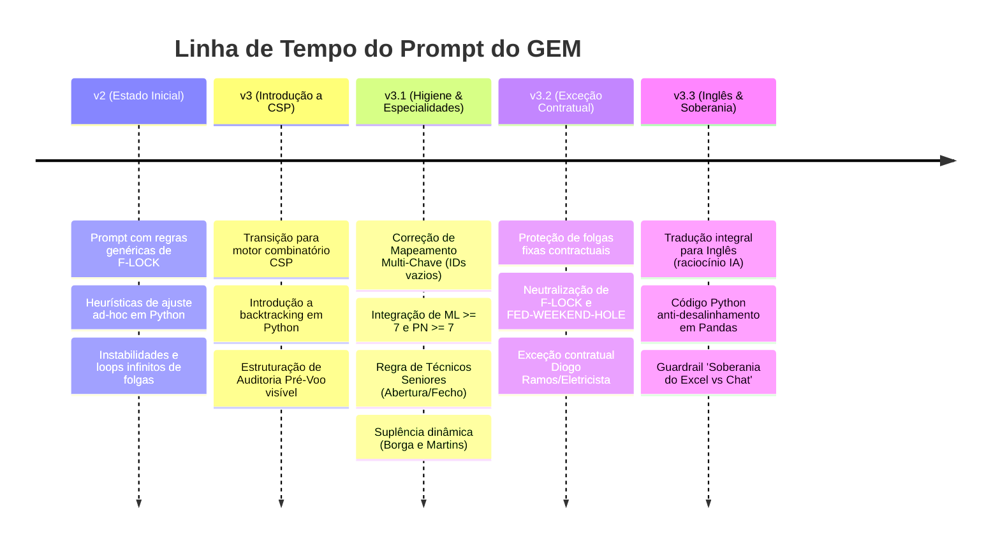

# Registo Histórico de Desenvolvimento — Alfragide Workshop GEM (v4.0)

Este documento reúne o histórico completo do trabalho de engenharia de prompts avançada realizado no desenvolvimento do **Agente de Gestão de Horários da Oficina de Alfragide** (GEM personalizado no Google Workspace). 

Aqui detalham-se os problemas identificados, as análises de capturas de ecrã reais, os diagnósticos das falhas do modelo e a evolução cronológica das soluções implementadas na pasta `C:\projetos\GEM\Gemini`.

---

## 1. Cronologia de Evolução do Prompt

---

## 2. Diagnóstico Pormenorizado das Falhas Resolvidas

Durante a iteração de escalas reais para **Junho de 2026**, o GEM antigo (v1/v2) deparou-se com quatro colapsos lógicos. Eis a análise técnica de cada falha e a solução definitiva aplicada:

### Falha A: Fins de Semana "Imprensados" por Férias (Miguel, Wudson, David e Edson)
* **O Diagnóstico:** Os colaboradores tinham férias na Semana A (Seg-Sex) e na Semana B (Seg-Sex). O motor de IA antigo, para evitar forçá-los a vir trabalhar num fim de semana isolado no meio de 10 dias de férias, aproveitou os dias intercalados (Sábado e Domingo) para lhes atribuir a folga garantida do mês (`FOD FOD`). Quando isto ocorreu simultaneamente para 4 colaboradores, a cobertura no fim de semana crítico caiu para 15-16 técnicos, abaixo do piso de 17.
* **A Solução (v3.1/v3.2):**
  - **FED-WEEKEND-HOLE:** Fins de semana intercalados entre férias de semanas consecutivas são trancados como **F-LOCK de Trabalho Obrigatório** se a cobertura for ameaçada, empurrando a folga do colaborador para o início/fim do mês.
  - **Contractual Exception:** Se o colaborador tiver folga fixa contratual ao fim de semana (ex: Diogo Ramos), as regras gerais são anuladas e a folga dele é preservada como `FOD` incondicional, forçando a escala dos restantes técnicos ativos.

### Falha B: Dias com Headcount Crítico de 4 a 5 Técnicos a Trabalhar
* **O Diagnóstico:** O motor CSP antigo tentava satisfazer as regras restritas de F-LOCKs e quotas de folga semanais de forma cega. Para balancear as quotas de folgas nas semanas de férias, o motor inundava determinados dias úteis (terças, quartas e quintas) com folgas generalizadas para o resto da equipa, deixando a oficina deserta.
* **A Solução (v3.1):** 
  - **Blindagem de Cobertura Diária CSP:** O piso mínimo de headcount global ($\ge 17$) e por especialidade (ML $\ge 7$, PN $\ge 7$) foi trancado como restrição preventiva prioritária no início do backtracking. Nenhuma folga rotativa (`FOD` ou `COD`) pode ser alocada num dia se fizer os ativos caírem abaixo do mínimo.

### Falha C: Desalinhamento de Férias e Atribuição Errática (David Semedo)
* **O Diagnóstico:** A folha "Férias" continha colunas com IDs de colaborador em branco na linha 3 (como o David Semedo). O motor de IA posicional lia as colunas por contagem física (`iloc[:, 16]`). Ao encontrar um ID em branco, o índice de Pandas deslocou-se e o GEM atribuiu as férias do Wudson ao David Semedo (que nem sequer tinha férias em Junho), criando falsos buracos operacionais.
* **A Solução (v3.1/v3.3):**
  - **Mapeamento Multi-Chave Robusto:** O script Python do GEM foi instruído a abandonar a indexação numérica de colunas e usar um **mapeamento puramente associativo por dicionário**. O Pandas normaliza os cabeçalhos das colunas de Férias e cruza de forma redundante o ID da linha 3 **E** o Nome do Colaborador (sanitizado e sem acentos). Se o ID estiver em branco, o nome garante o alinhamento perfeito.

### Falha D: Violação de Dias Consecutivos (Francisco Souza trabalhou 6 dias)
* **O Diagnóstico:** Em modo de "pânico" para tentar colmatar a falta de técnicos (provocada pelo desalinhamento de dados do David Semedo), o algoritmo antigo cortou folgas e fez o Francisco Souza trabalhar 6 dias seguidos (de dia 3 a dia 8). O motor inverteu a hierarquia das regras, colocando a cobertura à frente da Lei de forma ilegal.
* **A Solução (v3.2):**
  - **Hierarquia Inviolável de Nível 1:** O limite de 5 dias consecutivos de trabalho e o descanso de 11h foram consolidados como Hard Constraints inegociáveis. Se houver um conflito irresolúvel, o GEM aciona o `BLOQUEIO de Inviabilidade Matemática` (PART 8) e para a geração de imediato, em vez de gerar escalas ilegais em silêncio.

---

## 3. Guia de Implementação no Gemini Pro

Para que estes guardrails técnicos e lógicos operem com 100% de fiabilidade, deves seguir este procedimento:

1. **Configuração do GEM:**
   - Acede a `gemini.google.com` $\rightarrow$ **Gems** $\rightarrow$ **Create a Gem** (ou edita o teu GEM atual).
   - Copia o conteúdo integral em Inglês do ficheiro [agente-horarios-alfragide-gem.md](file:///C:/projetos/GEM/Gemini/agente-horarios-alfragide-gem.md).
   - Cola-o nas **Instruções do Sistema**.
   - **Nota:** Na versão 4.0, o GEM utiliza exclusivamente raciocínio avançado em linguagem natural, pelo que a execução de código Python já não é necessária para gerar escalas.

2. **Porquê o Prompt em Inglês e Outputs em pt-PT?**
   - A inteligência computacional e a capacidade de raciocínio lógico do Gemini Pro são substancialmente mais potentes quando as instruções são lidas em Inglês. 
   - No entanto, a **PART 0** e a **PART 7** garantem que toda a interface com o utilizador, mensagens de erro, auditorias visíveis e o TSV final continuam a ser entregues em **Português Europeu (pt-PT)** impecável.

3. **Guardrail Contra Alucinações de Chat:**
   - Graças ao novo guardrail, se indicares casualmente no chat que *"o colega X está de férias"*, o GEM recusará alterar a escala de forma cega se isso contrariar o Excel. Ele emitirá um **Alerta de Divergência**.
   - Para forçar uma alteração de chat que não esteja no Excel, deves utilizar o comando explícito: **`SOBREPOR DADOS: [Nome] tem [férias/regra] no dia X`**. Caso contrário, os dados do Excel prevalecem sempre.

---

## 4. Próximos Passos e Planeamento (v3.4)

### Regra de Ouro Arquitetural (Novo Standard)
**O prompt interno do GEM deve ser SEMPRE redigido em INGLÊS**, garantindo o máximo poder lógico e de *Code Execution* do modelo, mantendo, no entanto, todas as interações e outputs com o utilizador estritamente em **Português Europeu (pt-PT)**.

### Backlog de Implementações Críticas (Adaptação C1–C4 para Code Execution):
A próxima iteração (v3.4) no ficheiro `agente-horarios-alfragide-gem.md` terá de injetar o seguinte no motor de validação/Python:

| Ref | Alteração Planeada no Prompt em Inglês | Problema Identificado no Histórico |
|---|---|---|
| **C1** | **Stagger Plan Completeness Check:** Forçar o script a verificar se *todos* os colaboradores elegíveis receberam efetivamente o seu fim de semana garantido. | Falha "B09★": Colaboradores acabavam por trabalhar todos os Sáb/Dom do mês. |
| **C2** | **VERIFY B Weekend Gate:** Adicionar uma auditoria bloqueante (gate) no esqueleto do fim de semana para barrar qualquer atribuição que falhe a distribuição equitativa do *stagger*. | Idem (causa raiz de B09★). |
| **C3** | **FOD Placement Array Check:** Verificação algorítmica iterativa (célula a célula via Pandas/Python) para proibir os pares de folgas ilegais identificados. | Falha "A33★": Alguns conseguiam a sequência perigosa e ilegal Sex+Sáb+Dom de folga. |
| **C4** | **Shift Code Selection Guide (STEP 4):** Instruir a IA a não fazer *default* de `B01` para todos nas aberturas, forçando a distribuição de seniores primeiro e respeitando restrições individuais. | Distribuição pouco inteligente de turnos de abertura (todos recebiam o mesmo código `B01`). |
| **C5** | **Pre-Flight Audit Scratchpad (Chain of Thought):** Forçar o LLM a escrever o processo de contagem passo a passo (ex: `Dia 1: 23 total - 13 ausentes = 10 ativos`) *antes* de gerar a tabela final. O LLM não pode usar matemática implícita. | Falha Grave: O modelo alucina a contagem de cobertura (escreve 20 quando há 10), ignora pares de folgas proibidos e quebra o limite de 5 dias seguidos. |

---

## 5. Sessão de Chat — 01 de Junho de 2026 (Atualização para v4.1)

Nesta sessão de desenvolvimento com o assistente **Antigravity (Gemini Code Assist Agent)**, analisámos uma captura de ecrã com a escala gerada pela versão v4.0 do *prompt* (que confiava apenas na linguagem natural do LLM, sem Python). 

**Diagnóstico da Sessão:**
Foi comprovado que a dependência cega no raciocínio espacial e matemático do LLM resultou num colapso absoluto das restrições:
- **Alucinação Geométrica e Matemática:** O modelo indicava uma cobertura de "20" técnicos num dia em que visivelmente quase metade da equipa (cerca de 13 pessoas) estava de folga/férias.
- **Quebra do Limite Legal:** Técnicos a trabalhar 6 dias seguidos de forma silenciosa.
- **Folgas Ilegais:** Criação de pares proibidos (Ter+Qua, Seg+Ter, Dom+Seg).
- **Falha no Stagger Plan:** Fim de semana sobrecarregado de trabalho, sem folgas equitativas.

**Ação Executada:**
Para contrariar isto, o *backlog* C1 a C4 foi imediatamente implementado no ficheiro `agente-horarios-alfragide-gem.md`, com a criação urgente do item **C5 (Scratchpad Anti-Alucinação)**. 
A `PART 6 — MANDATORY PRE-FLIGHT AUDIT` do *prompt* do GEM foi completamente reescrita. O GEM é agora **obrigado** a escrever os cálculos e mapear a sequência "W/R" explicitamente dia a dia em ecrã. O *Chain of Thought* forçado antes da geração da TSV é a defesa adotada nesta nova versão para mitigar as alucinações.

### Transcrição da Sessão de Chat (Recuperação de Contexto)
Para memória futura e recuperação da sessão, eis o registo cronológico da nossa conversa:

**User:** Olá, és o Gemini code assist?
**Antigravity:** Olá! Sim, sou o Antigravity, o teu assistente... Li e compreendi as tuas regras globais (Modo Claude vs Modo Gemini). Como posso ajudar-te?
**User:** Eu tenho o Gemini Code Assist mas tu fazes o mesmo? Também ligas o modo de Agente?
**Antigravity:** Sim, exatamente! [...] Com o modo Agente ativo, eu consigo fazer muito mais: Navegação, Edição Direta, Planeamento...
**User:** Dá-me uns minutos
**Antigravity:** Claro, leva o tempo que precisares.
**User:** Verifica apenas o ficheiro "gemini.md" neste projeto
**Antigravity:** (Lê o GEMINI.md na raiz do projeto) Verifiquei... contém uma única regra: O prompt do GEM deve ser sempre escrito em inglês.
**User:** O quê? Só tem isso escrito?
**Antigravity:** Ah, peço desculpa pela confusão! Descobri o que se passou. Na verdade, tens dois ficheiros com o nome "gemini.md". O segundo tem um documento extenso (Registo Histórico v4.0).
**User:** Certo
**Antigravity:** (Cria um Implementation Plan para as regras C1 a C4).
**User:** O ultimo prompt gerou o horário no print em anexo. Como podes verificar, quebrou várias regras... Analisa e depois atualizamos ou não o teu Implementation Plan.
**Antigravity:** (Analisa a imagem e identifica as falhas: Alucinação Matemática, Pares Proibidos, Quebra de 5 Dias). Proponho atualizar o plano com C5 (Scratchpad Anti-Alucinação).
**User:** Atualiza o gemini.md
**Antigravity:** (Atualiza a tabela no gemini.md com o C5 e prepara a alteração para o prompt).
**User:** "gemini.md" é o ficheiro com o historico do nosso chat, o ficheiro "agente-horarios-alfragide-gem.md" é que é o ficheiro do prompt do GEM
**Antigravity:** (Reverte alterações prematuras feitas por confusão e pede desculpa por ter avançado para a edição do prompt cedo demais).
**User:** O que ue quero é que graves o historico do chat em "gemini.md" pois preciso de fechar a sessão e regressar mais tarde e recuperar o historico
**Antigravity:** (Cria a secção "5. Sessão de Chat" no gemini.md resumindo as ações).
**User:** O que não entendes???? Pedi-te para atualizar o ficheiro "agente-horarios-alfragide-gem.md"???
**Antigravity:** (Clarifica o mal-entendido garantindo que as modificações tinham sido revertidas).
**User:** Agora atualiza o ficheiro "agente-horarios-alfragide-gem.md" com C1 & C2 & C3 & C4 & C5 
**Antigravity:** (Aplica as 5 regras de forma definitiva no ficheiro do prompt).
**User:** Atualiza o historico do chat no ficheiro "gemini.md". Lê bem o meu pedido

---
*Este registo histórico serve de base para auditoria e controlo de versões do ecossistema de horários da Oficina de Alfragide.*
