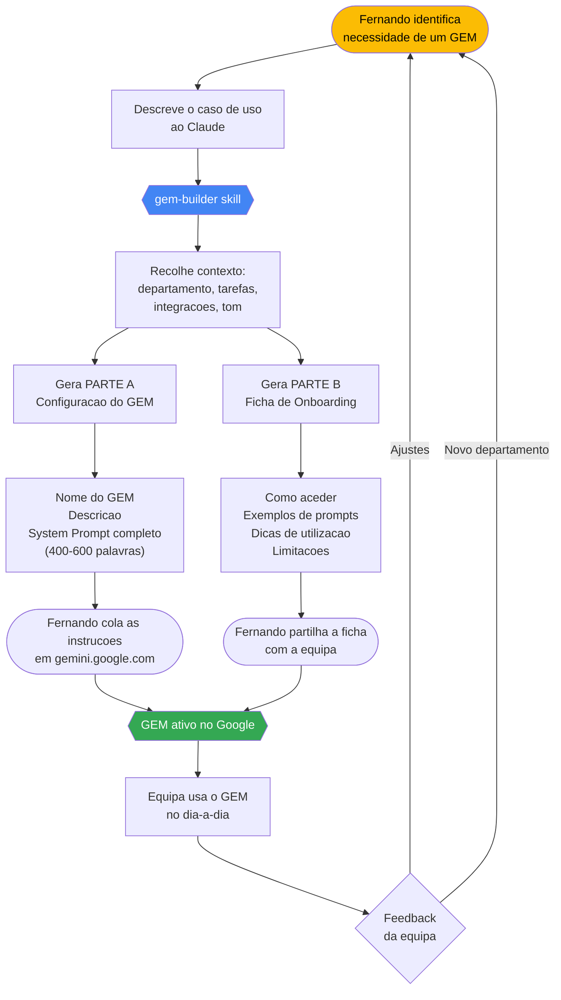
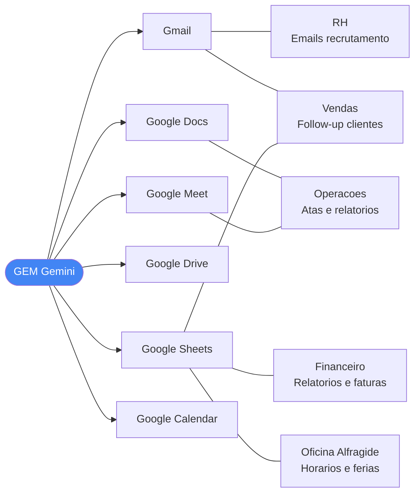
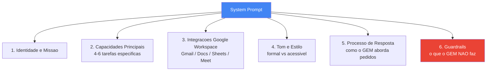

# Projeto GEM — Google AI Agents para Google Workspace

## Contexto

Projeto de Fernando Nankov para posicionar-se como Líder de IA na empresa.
A empresa opera 100% em **Google Workspace** (Gmail, Docs, Sheets, Drive, Meet, Calendar).

O objetivo é criar **Google GEMs** — agentes Gemini personalizados — para múltiplos departamentos, democratizando o uso de IA internamente.

---

## O que é um Google GEM

Um GEM é um agente de IA personalizado construído sobre o Gemini. Configura-se com:
- **Nome**: curto e memorável
- **Descrição**: 1-2 frases do que faz
- **Instructions**: o system prompt que define o comportamento, persona e capacidades

Para criar um GEM: `gemini.google.com` → "Gems" → "Create a gem"

---

## Workflow do Projeto



---

## Departamentos em Curso

| Departamento | Estado | GEM | Foco Principal |
|---|---|---|---|
| RH / Recrutamento | Planeado | Assistente RH | Triagem CVs, emails, descrições de funções |
| Vendas / Comercial | Planeado | GEM Vendas B2B | Propostas, follow-up, análise pipeline Sheets |
| Financeiro | Planeado | Analista Financeiro | Faturas, relatórios, Sheets |
| Operações | Planeado | GEM Operações | Atas, relatórios de projeto, Docs/Meet |
| Marketing | Futuro | — | — |
| Jurídico | Futuro | — | — |
| IT / Suporte | Futuro | — | — |

---

## GEM Especializado — Oficina Alfragide (Em Desenvolvimento Ativo)

GEM de gestão de horários para a Oficina do Centro de Alfragide. Mais complexo que os GEMs departamentais standard — inclui conformidade com Direito do Trabalho português, gestão de folgas rotativas, férias e continuidade entre meses.

**Ficheiro do prompt (versão ativa):** `c:\projetos\GEM\agente-horarios-alfragide.md` — linguagem natural, estrutura em 8 PARTS

**Versões alternativas (pasta python-gem):**
- `python-gem\agente-horarios-alfragide.md` — v2 Python (algoritmo estruturado)
- `python-gem\agente-horarios-alfragide-v3-csp.md` — v3 Python CSP (com dados reais da equipa, novos códigos FOD/FED/COD/AJD)

**Fonte de dados:** Upload do ficheiro `.xlsx` no início de cada sessão do GEM.
- Abrir Google Sheets → Ficheiro → Transferir → Microsoft Excel (.xlsx) → anexar no chat
- Não usar URL nem Knowledge sources — apenas upload direto funciona de forma fiável

**Estrutura do ficheiro de dados (5 folhas obrigatórias):**
- `Equipa e regras` — lista de colaboradores, turnos permitidos, regras individuais
- `Códigos` — legenda de todos os códigos de turno
- `Horários` — grelha template de horário
- `Férias` — dias FED por colaborador
- `Ausências` — AJ, FC e outras ausências
- *(+ folhas mensais anteriores para continuidade)*

**Modelo obrigatório:** Gemini Pro (Flash e Thinking param a meio das instruções e não leem as férias)

**Dias de encerramento:** apenas 25 de dezembro, 1 de janeiro e Domingo de Páscoa. Todos os outros feriados são dias normais de operação (oficina aberta 7 dias/semana, 365 dias/ano).

**Regra da fonte única:** um dia só é folga/férias se estiver marcado nos ficheiros. Feriados nacionais não geram folgas automáticas.

**Avaliação de qualidade:** o output é revisto por Claude (Anthropic) e ChatGPT (OpenAI) — declarado no prompt para aumentar a precisão do modelo.

**Regras implementadas no prompt (estrutura em 8 PARTS):**

| Secção | Conteúdo |
|---|---|
| PART 0 | Golden Rules: idioma pt-PT, fonte única (.xlsx), Source-Only Rule, avaliação LLM |
| PART 3 — STEP 3.1 | Leitura das 5 folhas obrigatórias por nome |
| PART 3 — STEP 3.4 | Carryover do mês anterior (contador C e fim de semana garantido) |
| PART 3 — STEP 3.5 | Leitura obrigatória da folha "Férias" com tabela visível + bloqueio se não encontrada |
| PART 3 — STEP 3.7 | Esqueleto mensal completo antes de qualquer turno: F-LOCK (buffer de férias), VERIFY A (≤5 dias consecutivos), VERIFY B (cobertura mínima + auditoria ⭐ fins de semana) |
| PART 4.1 | Lei n.º 7/2009 — máx. 5 dias consecutivos, 2 folgas/semana, 11h descanso |
| PART 4.2 | Dias ⭐ (Sex/Sáb/Dom), ⭐ Coverage Floor (Sáb/Dom têm mínimo mais alto — BLOQUEIO), Stagger Rule (máx. 2 col. no mesmo fim de semana garantido), encerramento, operação 365 dias, Vacation Buffer Rule, FED-Week Rule, FOD (pares proibidos) |
| PART 4.4 | Algoritmo de contador C com carryover entre meses |
| PART 5 | Processo interativo em 4 passos com aprovação obrigatória + F-LOCK Integrity Rule (células F-LOCK só recebem turno de trabalho) |
| PART 6 | Auditoria pré-voo Steps A–F visíveis (consecutivos, completude, FOD, buffer FED) |
| PART 7 | Output TSV, dias sempre em pt-PT (Seg/Ter/Qua...), cobertura diária, totais |

---

## Ecossistema Google Workspace nos GEMs



---

## Anatomia de um System Prompt GEM



---

## Skills Instaladas

### gem-builder
```
C:\Users\Utilizador\.claude\skills\gem-builder\SKILL.md
```
**Como usar**: Descreve o departamento e caso de uso ao Claude → a skill gera o GEM completo.

**Output garantido**:
- PARTE A: Nome + Descrição + System Prompt pronto a colar no Google
- PARTE B: Ficha de onboarding para a equipa (como aceder, exemplos de prompts, dicas)

**Evals testados** (iteration 1): RH/Recrutamento, Vendas B2B, Operações

---

## Regras de Qualidade dos GEMs

- **Língua**: Sempre português europeu. `ficheiro` não `arquivo`, `equipa` não `time`, `telemóvel` não `celular`
- **Extensão do system prompt**: 300-600 palavras para GEMs departamentais; GEMs especializados (como Alfragide) podem ser mais extensos
- **Especificidade**: Cada GEM deve parecer feito à medida para aquele departamento
- **Testabilidade**: O utilizador deve ver valor nos primeiros 60 segundos de uso
- **Guardrails**: Sempre presentes — definem o que o GEM não faz, constroem confiança
- **Fonte de dados (GEMs departamentais)**: Preferir Google Sheets (URL) em vez de upload de .xlsx — o Gemini lê Sheets nativamente folha a folha
- **Fonte de dados (Alfragide)**: Upload obrigatório de .xlsx — URL e Knowledge sources mostraram-se não fiáveis (leem folhas erradas ou número errado de colaboradores)

---

## Próximos Passos

1. **Alfragide** — testar o prompt restaurado com horário real de junho (anexar .xlsx no chat)
2. **Alfragide** — validar que o esqueleto mensal (STEP 3.7) + Coverage Floor + Stagger Rule eliminam todas as violações reportadas
3. **Alfragide** — iterar com feedback da equipa da oficina até aprovação
4. Criar GEM para RH com a skill gem-builder
5. Criar GEM para Vendas com a skill gem-builder
6. Criar GEM para Financeiro
7. Criar GEM para Operações
8. Expandir para departamentos adicionais (Marketing, Jurídico, IT)
